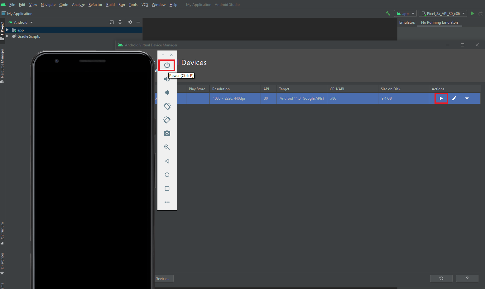
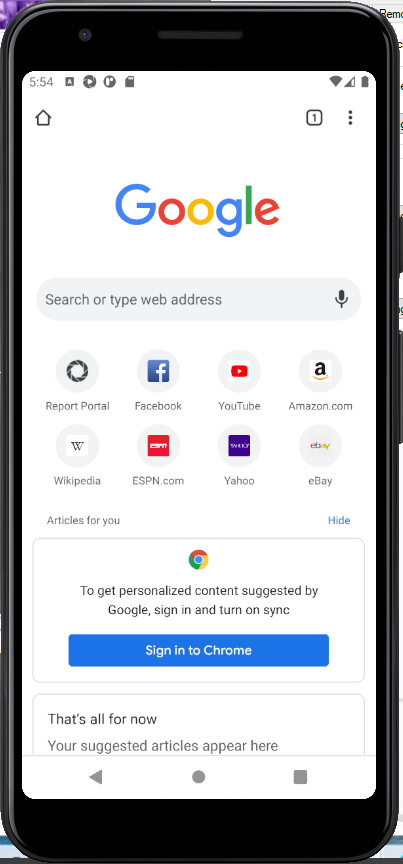
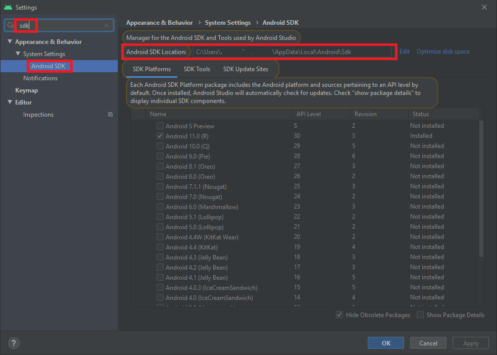
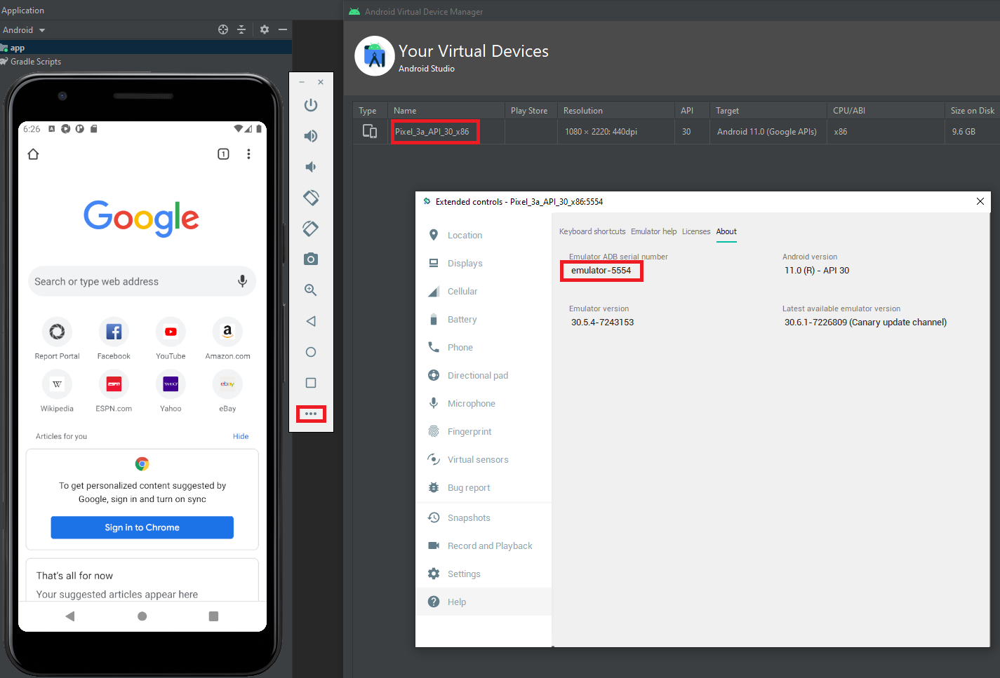

# JDI Mobile Example

## How to launch web tests on Android emulator  

Stable environment: Java 8, Maven 3.6.3, JDI-Light 1.3.22, TestNG 6.14.3, Aspectj 1.9.*, Appium 1.20.2, Android 10 <br/>

1. Launch Android emulator and wait until home screen is ready.
1. Launch Appium and find out the listening URL in the console (usually http://0.0.0.0:4723)
1. Set following settings in **test/resources/test.properties** file:
```
   driver=android 
   remote.type=appium
# should be URL form prev. step and remove leading # if any
   driver.remote.url=http://0.0.0.0:4724/wd/hub 
```
4. Set following settings in **test/resources/android.properties** file
```
# Section 'There we can find Device UID and name' and remove leading # if any
   deviceName={GET_UID_FROM_YOUR_ANDROID_VIRTUAL_DEVICE} 
```


More information about JDI-Light in [Documentation](https://jdi-docs.github.io/jdi-light/?java#introduction)
   
## External tools installation (for novice)

### Android emulator installation
The easiest way to use Android Emulator is via Android Studio, but it's also possible to install Android SDK only (https://developer.android.com/studio/releases/sdk-tools)
We describe a way via Android Studio.

1. Download and install Android Studio (https://developer.android.com/studio). Note: in case of error with HAXM installation just ignore it.
1. Run Android Studio
1. Run AVD Manager (Configure -> AVD Manager) (or via Tools -> AVD Manager for an open project)
1. Create a virtual device with any available parameters (for example, Pixel_3a_API_30_x86)
1. Run virtual device via button in Actions column 
1. Power up your device via Power button (is highlighted on a previous screen)
1. Open Chrome, confirm all agreements to get empty Chrome window with search field
1. Open About Chrome  and find Chrome version (chromedriver and Chrome version should be equal, so copy it. Needed after Appium installation)<br/>
   
   
Ready!

### Install Appium

1. Install Appium 
   * For Windows usually we need to install **npm** (https://nodejs.org/en/) and run `npm install -g appium`
   * All information is on official site https://appium.io/docs/en/about-appium/getting-started/?lang=en
   * After installation make sure that you can run appium in terminal:
     * (for Windows) add appium directory to PATH environment variable. If you used 'npm install ...' command for installation appium will be in C:\Users\\{USER_NAME}\AppData\Roaming\npm 
     * (for Windows) if you see error message like 'File cannot be loaded because the execution of scripts is disabled on this system. Please see "get-help about_signing" for more details' open new PowerShell terminal 'as Administrator' and run this command `Set-ExecutionPolicy -ExecutionPolicy Unrestricted`
1. Download chromedriver for Chrome with version equal to Chrome version on your device (The number before the first '.' should be equal!). More information https://github.com/appium/appium/blob/master/docs/en/writing-running-appium/web/chromedriver.md
   * Download correct version from https://chromedriver.chromium.org/downloads 
   * Put it to npm modules. For Windows example path is: `c:\Users\{USER_NAME}\AppData\Roaming\npm\node_modules\appium\node_modules\appium-chromedriver\chromedriver\win\`
1. (For Windows) Several environment variables are needed to work with emulator (**!Note** Restart Appium after this step if it's running (Ctrl+C can be used to stop Appium)):
   * JAVA_HOME - path to JDK installation folder (NOT bin folder inside!). Example 'c:\Program Files\Java\jdk1.8.0_281\'   
   * ANDROID_HOME - path to Android SDK, can be found in Android Studio in Menu `File -> Settings... -> Android SDK`. Example `c:\Users\{USER_NAME}\AppData\Local\Android\Sdk\`
   * ANDROID_SDK_ROOT - the same value as ANDROID_HOME
   * ANDROID_TOOLS - ANDROID_HOME\tools <br/>
   
     
     
### There we can find Device UID and name

1. Device name is visible in Android Virtual Device Manager in a list
1. UID is available in Extended controls (...) -> Help -> About



### Run jdi-mobile-report-portal-demo tests
1. Launch the created virtual device
1. Run 'appium' in console
1. Open the tests project in IDEA. (Optional)
1. Run the following maven command
```
mvn test -Dreport.portal.user=<user_name> -Dreport.portal.password=<user_password> -Dmobile.device.udid=<your_emulator_id> -Dmobile.cloud.type='EPAM' -Dmobile.platform.name=<Android_or_iOS> -Dmobile.platform.version=<platform_version> -Dmobile.device.name=<your_device_name> -Dmobile.device.orientation=portrait -Drp.uuid=<rp_uuid> -Drp.project=jdi -Drp.enable=false -Drp.attributes=env:dev-gcp;type:mobile -f pom.xml
```
